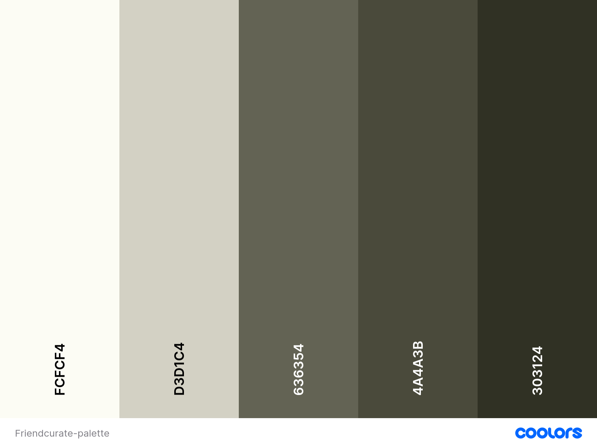

# Friendcurate 

## Features 

### Home Page 

The front page displays a gallery of art uploaded by users of the website, immediately demonstrating to the user the point of the website, which is a network for artists to share their artwork. Curious visitors can click on the artworks to see more information. 

When a visitor is not logged in and sees the website, there is a call to action inviting the visitor to join the website. 

### Navbar

The navigation bar changes depending on whether a user is logged in or not. 

When logged out, the visitor/user shall see the home page, the option to login or sign up to use the website. 

When logged in, the user will see the submit button to submit an image, the Home page, their username and avatar with a drop down for their profile, favourites and logout page. 

### Image Display Page 

This is the page for a single image posted; it will show the user when the image was uploaded, the caption, the title of the image. Logged in users are allowed to post comments and add the image to their favourites by bookmarking it. 

### Submit Image Page 

This page allows a logged-in user to upload an image to the website and give it a title as well as a caption. 

### Login Page 

This is the page to allow a user to log in by entering their email and password.

### Logout Page 

This is a page to confirm with the user if they want to log out or not. 

### Signup Page 

## UX 

### Colour Scheme 

The colour scheme for Friendcurate was selected from an image of a charcoal sketch, as it was fitting for the site's palette as a social network and image hosting site primarily aimed at artists with sufficient contrast. Also, the grey shades were selected to allow the user-uploaded images to pop out in the gallery. 

### Typography 

The Friendcurate logo is in the  font. The main header font for the main headers is  - to reflect the art element of the website. Some of the headings use the  to give a cool, retro feel to the website and accompanies the Rubik 80s Fade font. 

### Wireframes 

_Main Page_ 

* https://wireframe.cc/kxj2er - main page desktop

* https://wireframe.cc/rukpGh - main page ipad

* https://wireframe.cc/1K0dqB - main page mobile

_Favourites Page_

* https://wireframe.cc/B0jAuX  favourites desktop
* https://wireframe.cc/8G19GM  - favourites tablet
favourites mobile

_Profile Page_ 

* https://wireframe.cc/b7zDhR - profile desktop
* https://wireframe.cc/yqJ1Wa - profile tablet
* https://wireframe.cc/ccvz3a - profile mobile

### Data Schema 

 was for the data schema for Friendcurate which uses a relational model, as illustrated in the Entity Relationship Diagram (ERD) provided. Above is an Entity Relationship Diagram that shows the key models and their fields.

### User Stories

1. As a visitor to the site, I can create an account so I can comment on images, edit my comments and add images myself.

2. As a user, I can add images that other users can comment on and add to their favourites. 

3. As an admin, I can check images and captions, comments to make sure they are okay and up to date and approved. 

4. As a user, I can add images to my favourites collection and to be able to view my collection. 

5. As a user, I can sign in to the website so that I can access my account and enjoy customized features and contents.

6. As a user, I can sign out of the website when I finished using it for now.

7. As a site owner, I want to encourage visitors to become users of the website. 

### Agile Development