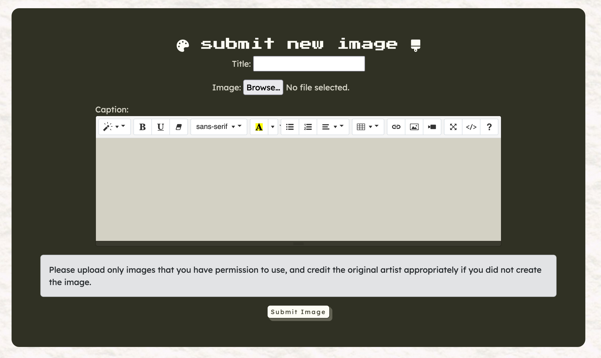
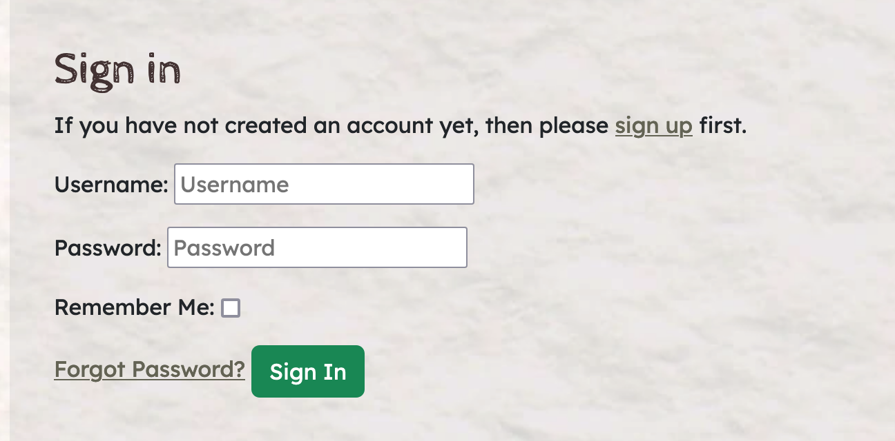
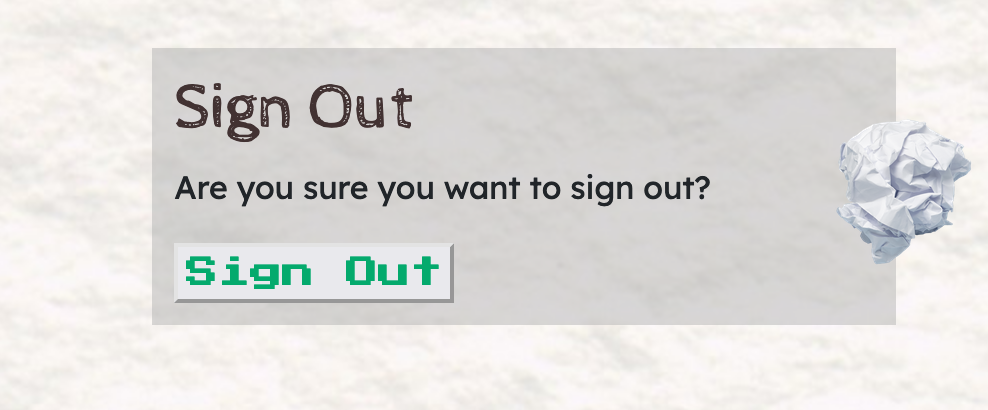

# Friendcurate 


[Vist the live website.](https://friendcurate-e7f12440f18f.herokuapp.com/)

Friendcurate is a community platform for art lovers to join, and share artworks where other users can comment and favourite such artworks. 

## Features 

### Home Page 


The front page displays a gallery of art uploaded by users of the website, immediately demonstrating to the user the point of the website, which is a network for artists to share their artwork. Curious visitors can click on the artworks to see more information. 


When a visitor is not logged in and sees the website, there is a call to action inviting the visitor to join the website. 


### Navbar

The navigation bar changes depending on whether a user is logged in or not. 

When logged out, the visitor/user shall see the home page, the option to login or sign up to use the website. 


When logged in, the user will see the submit button to submit an image, the Home page, their username and avatar with a drop down for their profile, favourites and logout page. 


### Image Display Page 


This is the page for a single image posted; it will show the user when the image was uploaded, the caption, the title of the image. Logged in users are allowed to post comments and add the image to their favourites by bookmarking it. 

### Submit Image Page 



This page allows a logged-in user to upload an image to the website and give it a title as well as a caption. 

### Contact Page 


This page allows a visitor or a user to subscribe to the newsletter as well as contact the site owners with feedback. 

### Login Page 



This is the page to allow a user to log in by entering their email and password.

### Signout Page 

This is a page to confirm with the user if they want to log out or not. 

### Signup Page 


This is for visitors to register for an account with the website. 

## UX 

### Colour Scheme 


The colour scheme for Friendcurate was selected from an image of a charcoal sketch, as it was fitting for the site's palette as a social network and image hosting site primarily aimed at artists with sufficient contrast. Also, the grey shades were selected to allow the user-uploaded images to pop out in the gallery. 

### Typography 

The Friendcurate logo is in the [Rubik 80s Fade](https://fonts.google.com/specimen/Rubik+80s+Fade) font. The main header font for the main headers is [Cabin Sketch](https://fonts.google.com/specimen/Cabin+Sketch) - to reflect the art element of the website. Some of the headings use the [Press Start 2P](https://fonts.google.com/specimen/Press+Start+2P) to give a cool, retro feel to the website and accompanies the Rubik 80s Fade font. 

### Wireframes 

_Main Page_ 

* [main page desktop](https://wireframe.cc/kxj2er)
* [main page tablet](https://wireframe.cc/rukpGh)
* [main page mobile](https://wireframe.cc/1K0dqB)

_Image Page_

* [image page desktop](https://wireframe.cc/uvEuhR)
* [image page tablet](https://wireframe.cc/GXKa5m)
* [image page mobile](https://wireframe.cc/G0QL0L)

_Favourites Page_

* [favourites desktop](https://wireframe.cc/B0jAuX)
* [favourites tablet](https://wireframe.cc/8G19GM)
* [favourites mobile](https://wireframe.cc/EpAQln)

_Contact Page_

* [contact page desktop](https://wireframe.cc/g8eHLm)
* [contact page tablet](https://wireframe.cc/SGlbw4)
* [contact page mobile](https://wireframe.cc/LlWFUj)

_Profile Page_ 

* [profile desktop](https://wireframe.cc/b7zDhR)
* [profile tablet](https://wireframe.cc/yqJ1Wa) 
* [profile mobile](https://wireframe.cc/ccvz3a)

### Data Schema 


[Lucidchart](https://www.lucidchart.com/pages) was for the data schema for Friendcurate which uses a relational model, as illustrated in the Entity Relationship Diagram (ERD) provided. Above is an Entity Relationship Diagram that shows the key models and their fields.


### User Stories

1. As a visitor to the site, I can create an account so I can comment on images, edit my comments and add images myself.

2. As a user, I can add images that other users can comment on and add to their favourites. 

3. As an admin, I can check images and captions, comments to make sure they are okay and up to date and approved. 

4. As a user, I can add images to my favourites collection and to be able to view my collection. 

5. As a user, I can sign in to the website so that I can access my account and enjoy customized features and contents.

6. As a user, I can sign out of the website when I finished using it for now.

7. As a site owner, I want to encourage visitors to become users of the website. 

### Agile Development 

This project was managed and developed by using the Project Board and Issues section on GitHub - visit the project board [here.](https://github.com/users/acmuckian/projects/4)

## Deployment 

The live deployed application can be found on [Heroku](https://friendcurate-e7f12440f18f.herokuapp.com/).

### 

### Forking 

To fork this repository, follow the below steps:

1. Login to Github.
2. Go to the repository for this project.
3. Click on the grey "fork" button on the repository main page. 
4. This should give you a forked copy in your GitHub account.


### Making a Clone 


The repository can also be cloned for local deployment. To clone the repository:

1. Login to Github.
2. Go to the repository for this project.
3. Click on the green "Code" button on the repository main page and copy the link shown.
4. Open the terminal in the code editor. 
5. Clone the repository.

### Local Deployment 

1. Clone responsitory as detailed above. 

### Heroku Deployment 

1. Log in or create a Heroku account. 
2. On the dashboard, click on the "new" button and then "create new app".
3. Give the app a name which is unique, and select the location for Common Runtime. I selected **Europe** where I am based. 
4. Click create app. 
5. After this, in the Config Vars, click reveal and insert the following variables:

| Key                   | Value                        |
|-----------------------|------------------------------|
| DATABASE_URL          | user's own value             |
| DISABLE_COLLECTSTATIC | _1 (mainly used only during initial setup)_ |
| CLOUDINARY_URL        | user's own value             |
| SECRET_KEY            | user's own value             |

6. Ensure procfile is in the repository as required by Heroku - install with 
`echo web: gunicorn app_name.wsgi > Procfile`

(instead of app_name, put in your own app's name)
7. install dependencies using 
`pip install -r requirements.txt`
8. Select Automatic Deployment from the Heroku app to connect to your repository - alternatively, you can deploy manually via Heroku CLI or GitHub integration. 
9. Manual deployment can be done as follows:
- log in to Heroku from the terminal 
` heroku login -i `
- set the heroku remote (replace app_name with name of your heroku app) 
` heroku git:remote -a app_name `
- add, commit and push changes to github 
``` git add . git commit -m 'commit message'  git push heroku main ```
- deploy to heroku by pushing the code: 
`git push heroku main`


## Testing 

Please refer to the [testing page](TESTING.md) for information about testing and bugs. 

## Credits 

- [Very Academy](https://www.youtube.com/@veryacademy)'s youtube tutorial _Learn Django 3_ has been useful for features like the user profile, and creating a favourites feature.
- [Django](https://www.djangoproject.com/)'s official documentation was also very helpful. 
- [Stack Overflow](https://stackoverflow.com/questions) and Copilot GPT-4.1 in the Visual Studio Code Desktop were both useful for debugging errors. 
- [Code Institute](https://codeinstitute.net/)'s tutorial on setting up a blog using Django was extremely helpful and the basis of my project. 
- For the basis of this website, sites like [Art Fight](https://artfight.net/) and [DeviantArt](https://www.deviantart.com/) were influential. 
- [Unsplash](https://unsplash.com/) was used to source some of the images. 


