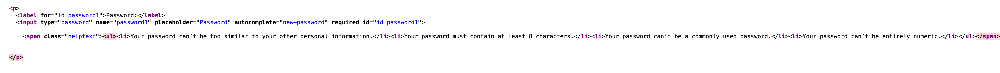
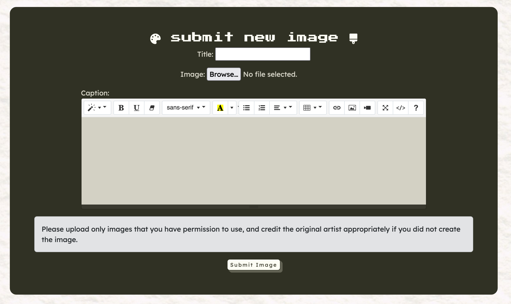
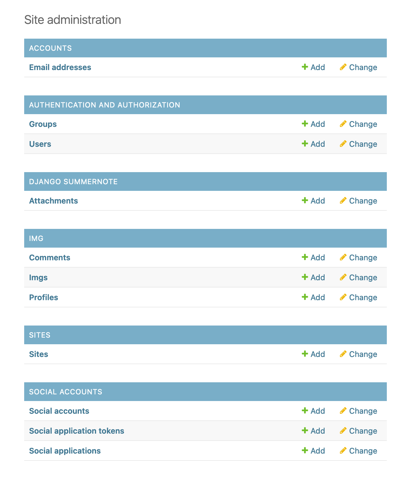
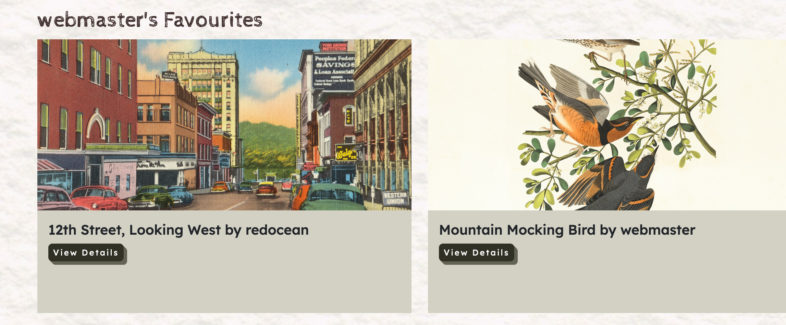
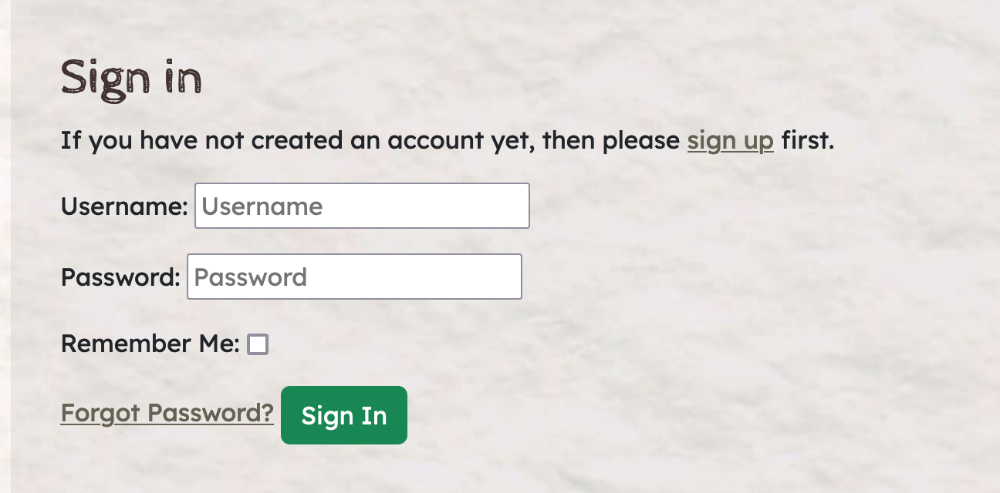
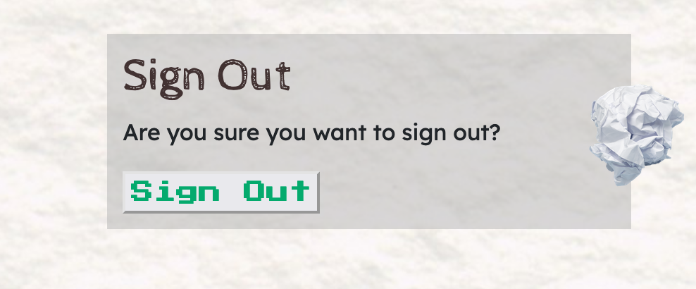
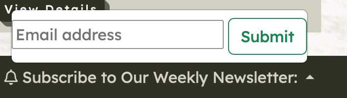

## Table of Contents
- [Performance](#performance)

- [Browser Compatibility](#browser-compatibility)
- [Responsiveness](#responsiveness)

- [Code Validation](#code-validation)

- [Testing](#testing)
  - [Automated Testing](#automated-testing)
   - [Manual Testing](#manual-testing)
  - [Features Testing](#features-testing)

## Performance

### Google Lighthouse Performance

[Google Lighthouse](https://developers.google.com/web/tools/lighthouse) was used to test the performance of the website.

The main limitation was file sizes - particularly since this is an image board website since users can upload files which are quite large. In future, attempts will be made to limit 

## Browser Compatibility

| Browser | Responsive |
|---------|------------|
| Chrome  | Yes        |
| Mozilla |    Yes       |
| Safari  |  Yes         |

## Responsiveness 

The website was tested across different browsers. It was also tested on a MacBook Pro version 12.7.6 and an iPhone 8. 

The website was tested on different mobiles and tablets, including by using Google's DevTools:

* Galaxy Note 20 Android 11
* iPad iPad OS 14.7.1 
* iPhone 11 Pro iOS 14.6

## Code Validation 

### HTML 

[HTML W3C Validator](https://validator.w3.org/nu/) was used to validate the HTML files. 

* [Home Page](https://validator.w3.org/nu/?doc=https%3A%2F%2Ffriendcurate-e7f12440f18f.herokuapp.com%2F) - no errors/warnings found 
* [Image Page](https://validator.w3.org/nu/?doc=https%3A%2F%2Ffriendcurate-e7f12440f18f.herokuapp.com%2Fcabernet) - some of the images had no errors/warnings to show. 
* [Submit Page](https://validator.w3.org/nu/?doc=https%3A%2F%2Ffriendcurate-e7f12440f18f.herokuapp.com%2Fsubmit) - no errors/warnings found but one info: Trailing slash on void elements has no effect and interacts badly with unquoted attribute values.
* [Contact Page](https://validator.w3.org/nu/?doc=https%3A%2F%2Ffriendcurate-e7f12440f18f.herokuapp.com%2Fcontact%2Fcontact_us) - no errors/warnings found
* [Favourites Page](https://validator.w3.org/nu/?doc=https%3A%2F%2Ffriendcurate-e7f12440f18f.herokuapp.com%2Ffavourites) - no errors/warnings found but one info: Trailing slash on void elements has no effect and interacts badly with unquoted attribute values.
* [Login Page](https://validator.w3.org/nu/?doc=https%3A%2F%2Ffriendcurate-e7f12440f18f.herokuapp.com%2Faccounts%2Flogin) - no errors/warnings to show 
* [Sign Up Page]() - some of the errors came from Django's built-in password validation text and I did not want to interfere with the functionality of the website, so these were left as is. 

* [Logout Page](https://validator.w3.org/nu/?doc=https%3A%2F%2Ffriendcurate-e7f12440f18f.herokuapp.com%2Faccounts%2Flogout) - no errors/warnings to show 

### Javascript 

[JSHint](https://jshint.com/) was used to check the validity of the javascript on comments.js and img_delete.js - comments.js had no errors once /* global bootstrap */ was used so the JSHint warning about bootstrap being an undeclared variable left. This was the same for img_delete.js. 

### CSS 

[Jigsaw CSS](https://jigsaw.w3.org/css-validator/) was used to validate the CSS via a direct upload of the styles.css file. There were no errors and 8 warnings. 

### Python 

[PEP8 CI Python Linter](https://pep8ci.herokuapp.com/#) was used to validate the Python code by PEP8 standards.

- _contact/models.py_ - all clear, no errors found 
- _contact/forms.py_ - all clear, no errors found
- _contact/views.py_ - all clear, no errors found 

- _img/admin.py_ - all clear, no errors found
- _img/models.py_ - all clear, no errors found 
- _img/forms.py_ - all clear, no errors found
- _img/views.py_ - all clear, no errors found

## Testing 

### Automated Testing 

Automated testing was performed for some of views and forms for both img and contact. Due to time constraints, only six tests were made - these six tests passed with OK. 

### Manual Testing

| User Story                                                                                                            | Responsive |
|-----------------------------------------------------------------------------------------------------------------------|------------|
| As a visitor to the site, I can create an account so I can comment on images, edit my comments and add images myself. | Yes        |
| As a user, I can add images that other users can comment on and add to their favourites.                              |            |
| As an admin, I can check images and captions, comments to make sure they are okay and up to date and approved.        |            |
| As a user, I can add images to my favourites collection and to be able to view my collection.                         |            |
| As a user, I can sign in to the website so that I can access my account and enjoy customized features and contents.   |            |
| As a user, I can sign out of the website when I finished using it for now.                                            |           |
| As a site owner, I want to encourage visitors to become users of the website.                                         |           |

## Features Testing 

| **Home   Page**                                                |            |
|----------------------------------------------------------------|------------|
| **Feature**                                                    | **Status** |
| Clicking   Friendcurate shows home page.                       | Yes        |
| If   signed out - Home, Contact, Login, Register show on navbar         | Yes        |
| If   signed out - banner to join Friendcurate appears          | Yes        |
| Clicking   login brings to login page                          | Yes        |
| Clicking   register brings to register page                    | Yes        |
| Clicking   home brings to home page                            | Yes        |
| **Carousel**                                                   |            |
| Clicking   back and forwards buttons work                      | Yes        |
| Carousel   moves automatically                                 | Yes        |
| Clicking   on image title goes to image page                   | Yes        |
| **Images**                                                     |            |
| Clicking   on view details button goes to image page           | Yes        |
| Hoovering   over image skews image                             | Yes        |
| **Footer**                                                     |            |
| Cannot   subscribe without entering email                      | Yes        |
| clicking   social media icons brings to that social media site | Yes        |

| **Home   Page**                                                |            |
|----------------------------------------------------------------|------------|
| **Feature**                                                    | **Status** |
| Clicking   Friendcurate shows home page.                       | Yes        |
| If   signed out - Home, Login, Register show on navbar         | Yes        |
| If   signed out - banner to join Friendcurate appears          | Yes        |
| Clicking   login brings to login page                          | Yes        |
| Clicking   register brings to register page                    | Yes        |
| Clicking   home brings to home page                            | Yes        |
| **Carousel**                                                   |            |
| Clicking   back and forwards buttons work                      | Yes        |
| Carousel   moves automatically                                 | Yes        |
| Clicking   on image title goes to image page                   | Yes        |
| **Images**                                                     |            |
| Clicking   on view details button goes to image page           | Yes        |
| Hoovering   over image skews image                             | Yes        |
| **Footer**                                                     |            |
| Cannot   subscribe without entering email                      | Yes        |
| clicking   social media icons brings to that social media site | Yes        |

| **Image   Page**                                                     |            |
|----------------------------------------------------------------------|------------|
| **Feature**                                                          | **Status** |
| Clicking bookmark button adds to   favourites                        | Yes        |
| adding   comment allows a comment to be added                        | Yes        |
| a   comment will have a red note saying it's awaiting approval       | Yes        |
| clicking   edit on the comment button allows an edit box to come up  | Yes        |
| clicking   save on the edited version lets the edited version appear | Yes        |
| clicking   the delete button deletes the comment                     | Yes        |

| **Submit   Image**                                                                |            |
|-----------------------------------------------------------------------------------|------------|
| **Feature**                                                                       | **Status** |
| Unable   to submit an image without a title                                       | Yes        |
| Unable   to submit an image without caption                                       | Yes        |
| Error   messages for when attempt to upload an image without title and/or caption | Yes        |
| Unable   to submit without an image                                               | Yes        |
| Error   message if attempt to submit without image                                | Yes        |
| Successful   submit redirects to home page                                        | Yes        |

| **Login Page and Sign Out Pages**                                            |            |
|------------------------------------------------------------------------------|------------|
| **Feature**                                                                  | **Status** |
| entering   the wrong username or passowrd prompts an error message           | Yes        |
| clicking   forget password goes to the forget password page                  | Yes        |
| successfully   putting in username and password sends user to logged in site | Yes        |
| clicking   on the link to sign up brings user to sign up page                | Yes        |
| **sign out page**                                                            |            |
| clicking sign out signs the user out                                         | Yes        |

| **Profile   Page**                                                |            |
|-------------------------------------------------------------------|------------|
| **Feature**                                                       | **Status** |
| Email   can be updated by inserting an email in the relevant box  | Yes        |
| Bio can   be updated by inserting an email in the relevant box    | Yes        |
| Avatar   can be updated by inserting an email in the relevant box | Yes        |
| Users can   see their own avatar, bio and email                   | Yes        |

| **Contact   Page**                               |            |
|--------------------------------------------------|------------|
| **Feature**                                      | **Status** |
| Cannot   submit newsletter without email         | Yes        |
| Cannot   submit contact form without name        | Yes        |
| Cannot   submit contact form without email       | Yes        |
| Cannot   submit contact form without message     | Yes        |
| successful   newsletter submission prompts modal | Yes        |
| successful   contact submission prompts modal    | Yes        |

## Bugs 

| Bug | Fix |
|---------|------------|
| The dropdown bar prevented an email from being required before the submit button was clicked for the newsletter. This bug persisted so the dropdown feature was dropped for the newsletter feature.  | The dropdown feature was changed so the form appeared without any dropdown.   |
| Clicking the dropdown menu on the profile expanded beyond the viewport width. | Adding the bootstrap class "dropdown-menu-end" caused it to open on the left and prevented it from expanding beyond the viewport width.           |
| The "favourite" button didn't show users when they already favourited an image.  |   Django template coding was used so when an image was favourited a different button was shown instead.          |
|     |           |